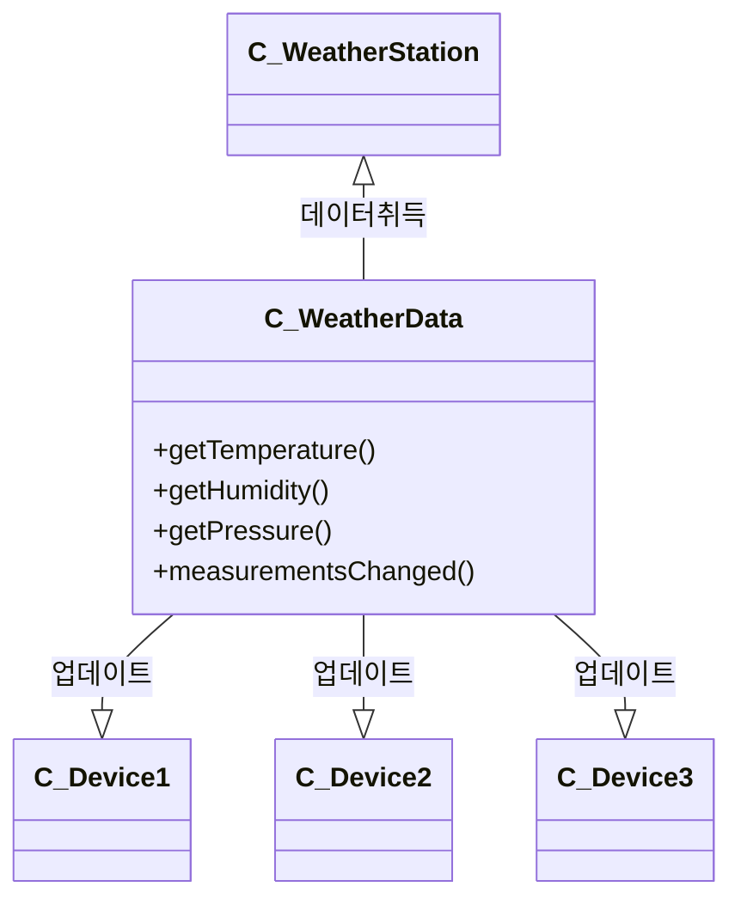

## 문제상황
<blockquote>

* measurementsChanged를 통해서 Device를 갱신 해줘야한다
  * measurementsChanged 는 기상 관측값이 갱신될 때마다 호출이 자동으로 된다
  * 어떻게 언제 호출되는지는 우리가 알 필요가 없다 

</blockquote>

## 해결 방법

<blockquote>
</blockquote>

## 수호원칙

<blockquote>

</blockquote>

## 얻을 수 있는 장점

<blockquote>

</blockquote>

## 구현 방법

